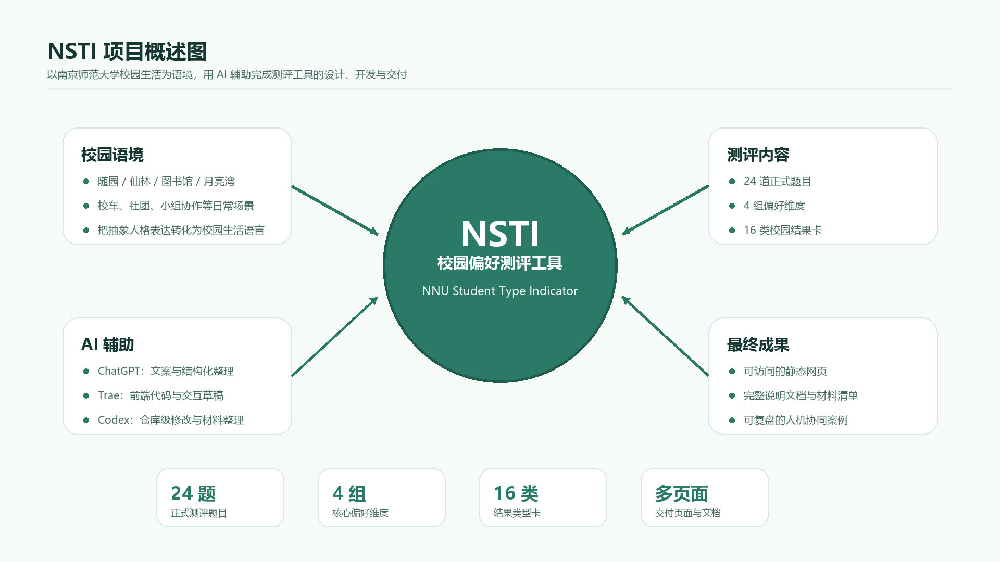
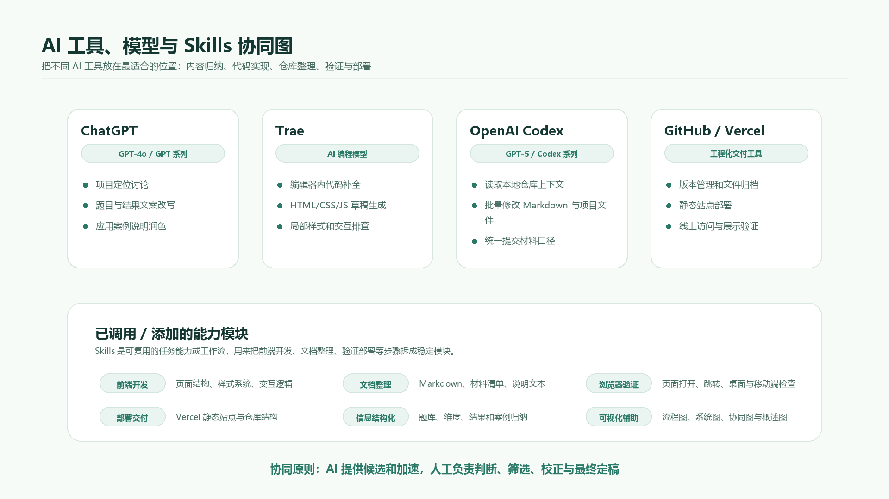
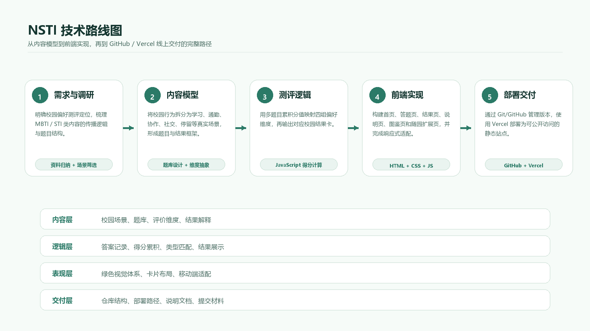
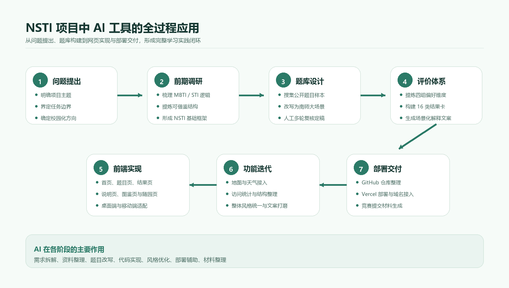
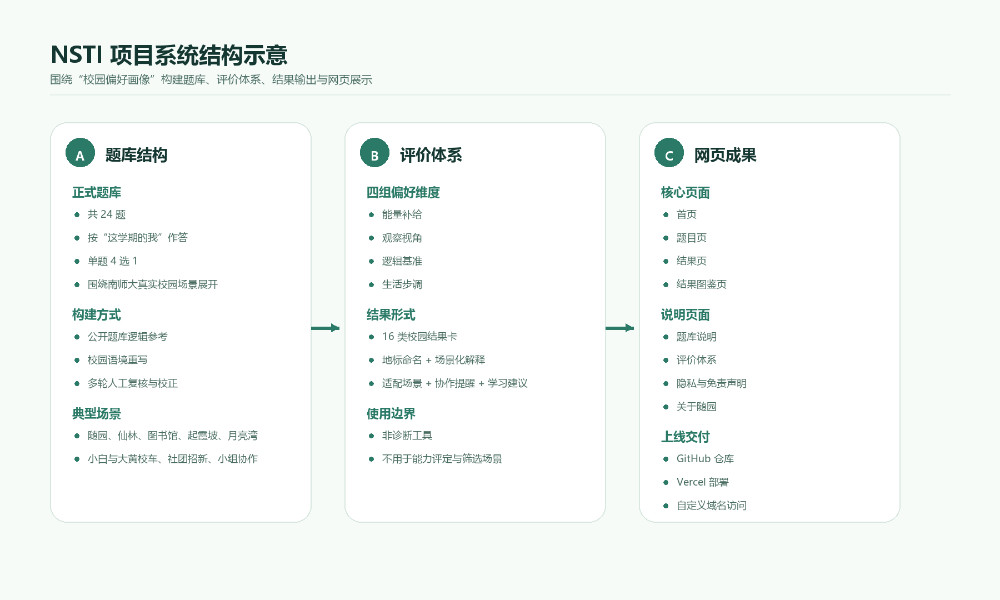
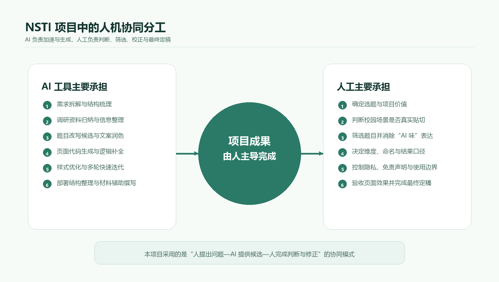
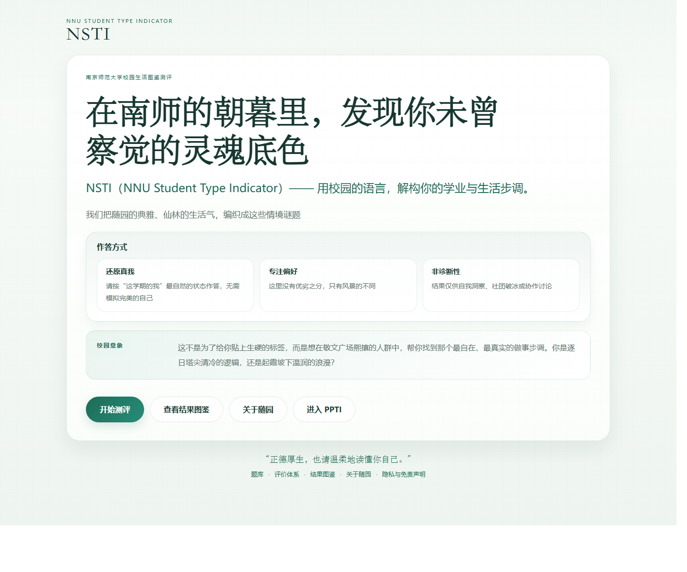

# 应用案例说明

## 案例名称

基于人工智能辅助的校园偏好测评工具设计与实现：以 NSTI（NNU Student Type Indicator）项目为例

## 一、任务背景

在当前高校学习生活中，MBTI 等人格测试工具具有较高传播度，也逐渐进入同学们的日常讨论、社团破冰与自我表达场景。但在实际使用中，我发现这类工具普遍存在两个问题：第一，题目与结果表述较为抽象，难以直接对应真实校园生活；第二，结论大多来自通用模型，缺少对本校学习环境、空间场景与学生行为习惯的贴合。

基于这一观察，我尝试围绕南京师范大学的真实校园生活，设计一套更具本校语境的偏好测评工具，并将其命名为 NSTI（NNU Student Type Indicator）。这一项目并不是对现有人格测试的简单复制，而是希望把学生在学习、通勤、协作、社交和校园停留中的真实行为偏好，转化为一套更容易理解、讨论和使用的校园表达系统。

与此同时，我将本项目作为一次完整的人工智能辅助学习实践。需要说明的是，我主要使用的并不是单纯的网页端聊天工具，而是 OpenAI Codex 这一类运行在编辑器和本地项目环境中的 agent。它和网页端 ChatGPT、Gemini 的区别在于：网页端模型更适合讨论、问答和生成片段内容；Codex 这类 agent 则可以直接读取项目文件、理解仓库结构、修改代码和文档、运行命令，并根据结果继续调整。也就是说，它不是只“回答我”，而是能在项目现场和我一起把任务往前推进。

我的实际操作方式大致是：先由我确定创意边界和项目方向，再用自然语言把需求、审美倾向和具体限制说清楚；随后借助模型把这些想法整理成更准确的提示词或任务说明，交给 Codex 这样的编辑器 agent 去执行。它负责把提示词转化为代码、页面、文档和配图生成脚本，我再对结果进行筛选、修改和验收。因此，NSTI 并不是 AI 自动生成的作品，而是一次“人提出创意与判断，agent 承担执行和迭代”的协作实践。

## 二、任务目标

本项目的目标主要包括以下三点：

1. 设计一套贴近南京师范大学校园生活的偏好测评体系，而不是照搬现成人格测试框架
2. 构建一个可实际运行的网页工具，实现“题目作答—结果生成—结果展示”的完整闭环
3. 系统总结人工智能在项目型学习任务中的应用方式，形成可展示、可复盘、可提交的案例材料

项目整体概述见配图：

## 三、所使用的 AI 工具及功能定位

在本项目中，我主要将 AI 工具作为“研究辅助、设计辅助、开发辅助与文档辅助”的综合性助手来使用。项目并不是只使用单一聊天工具，而是以 OpenAI Codex 这类编辑器 agent 为主，再配合通用大语言模型、前端开发工具、代码仓库管理工具和部署工具。其核心功能定位如下：

### 1. 大语言模型工具

用于需求拆解、概念澄清、资料归纳、题目改写、结果文案生成、页面文案润色和材料整理。

### 2. AI 辅助编程工具

用于前端页面结构搭建、交互逻辑实现、样式调整、目录整理、部署结构优化与代码排查。

### 3. AI 信息结构化能力

用于帮助我从大量公开资料、题库样本、校园场景素材与项目文档中快速提炼有效信息，并形成系统化结构。

### 4. 具体工具使用说明

本项目中使用到的主要工具可以分为以下几类：

1. ChatGPT / Gemini 等网页端通用大语言模型：主要用于前期头脑风暴、项目定位讨论、题目表达改写、结果文案生成、说明材料润色与结构化整理。它们更像可以反复交流的文字与研究助手，适合帮助我把模糊想法说清楚，但通常不直接接触本地项目文件。
2. Trae：主要用于前端开发阶段的 AI 辅助编码，包括页面结构搭建、HTML/CSS/JavaScript 片段生成、样式调整建议、交互逻辑初稿生成和局部 bug 排查。Trae 的作用更接近“AI 编程工作台”，适合在编辑器环境中快速尝试不同实现方案。
3. OpenAI Codex：本项目的主要 AI 工具。它作为编辑器和本地仓库中的 agent 使用，负责读取项目上下文、理解文件结构、修改 HTML/CSS/JavaScript 与 Markdown/LaTeX 文档、运行生成脚本和编译命令，并根据运行结果继续迭代。Codex 的优势在于可以结合本地仓库上下文进行连续修改，而不是只回答单个问题。
4. Git / GitHub：用于项目版本管理、文件归档、代码托管和后续提交。通过版本管理，可以保留不同阶段的修改痕迹，方便回看项目从原型到正式材料的演变过程。
5. Vercel：用于静态网页部署和在线访问验证，使 NSTI 从本地页面变成可公开展示的在线项目。项目还接入了基础访问统计能力，用于了解页面访问情况。
6. 高德地图、天气等开放能力：用于“关于随园”等扩展页面的信息展示，让项目不仅是单一测评页面，也能够呈现一定的校园生活服务和文化表达属性。

### 5. 已添加和调用的 Skills / 能力模块

这里所说的 Skills，并不是单独的某一个软件，而是 AI agent 在执行任务时可以调用或复用的能力模块。它更接近一套被整理好的工作流：例如遇到前端页面问题时，调用前端开发与浏览器验证能力；遇到提交材料问题时，调用 Markdown/LaTeX 文档整理能力；遇到部署问题时，调用 Vercel 与项目交付能力。这样做的好处是，任务不会停留在一次性的聊天回答里，而是能被拆成更稳定、更可检查的执行步骤。

在 AI 辅助开发过程中，我并不是让模型一次性生成完整项目，而是按任务拆分调用不同能力。项目中涉及的 skills 或能力模块主要包括：

1. 前端开发与静态站点整理能力：用于 HTML 页面结构、CSS 样式系统、JavaScript 交互逻辑、移动端适配和静态资源路径整理。
2. 文档撰写与 Markdown 整理能力：用于应用案例说明、材料清单、题库说明、评价体系说明、隐私与免责声明等文档的补充、改写和统一格式。
3. 浏览器验证与页面检查能力：用于检查页面是否能正常打开、跳转是否正确、移动端与桌面端是否存在明显排版问题。
4. Vercel 部署与项目交付能力：用于梳理静态站点部署结构、确认线上访问路径、整理可提交的项目目录和说明材料。
5. 资料归纳与信息结构化能力：用于把公开题库参考、校园场景素材、测评维度、结果类型和项目说明整理成清晰的层级结构。
6. 配图与可视化辅助能力：用于生成或整理“AI 应用全过程”“NSTI 系统结构”“人机协同分工”等流程图和说明图的内容结构。

这些 skills 的作用不是替代项目决策，而是把复杂任务拆成更容易处理的子任务。比较常见的流程是：我先描述目标，例如“把这段材料写得更像真实项目复盘”“把工具部分补充 Codex 和网页端模型的区别”“重新生成一张更清楚的流程图”；随后让模型把需求整理成更准确的提示词或任务清单，再交给 Codex 在项目文件中实施。这样每一步都更容易检查，也更容易发现不合适的内容。

对应工具与能力模块关系见配图：

### 6. 使用模型说明

本项目使用的大模型以 GPT 系列和代码辅助模型为主，不同阶段侧重点不同：

1. GPT-4o / GPT 系列通用模型：主要用于中文文案、项目说明、题目改写、结果解释、反思总结等偏内容生产与结构化整理的任务。
2. GPT-5 / Codex 系列代码模型：主要用于本地仓库级别的代码阅读、文件修改、调试建议、文档补充和工程化整理任务。
3. Trae 中的 AI 编程模型：主要用于编辑器内代码补全、前端页面草稿生成、样式修改和局部逻辑排查。具体模型以 Trae 使用时界面显示的模型为准，项目实践中主要将其作为代码生成与快速迭代工具使用。

总体来说，内容类任务会参考通用大语言模型的表达与归纳能力，工程类任务更依赖 OpenAI Codex 和 Trae 这类面向代码场景优化的工具。这里的关键区别不只是“模型名称不同”，而是使用场景不同：网页端模型更多承担讨论和提示词润色，Codex 则作为 agent 接收这些经过整理的任务说明，进入项目环境中完成连续操作。

### 7. 技术路线说明

NSTI 的技术路线可以概括为“内容模型设计 + 静态前端实现 + 线上部署展示 + 文档化交付”四个层次。

第一层是内容模型设计。项目先确定“校园偏好测评”这一定位，再围绕学习节奏、空间偏好、协作方式、社交状态等校园生活维度设计题目和结果。AI 在这里主要参与资料归纳、题目草案生成和结果文案润色，我负责判断这些内容是否符合南师大真实语境。

第二层是测评逻辑设计。项目采用多题目、多维度累积分值的方式，把用户选项映射到不同偏好维度，再根据最终得分组合生成结果类型。相比直接套用 MBTI 字母，本项目更强调校园场景表达，因此结果输出采用“校园锚点 + 场景解释 + 行动建议”的形式。

第三层是前端工程实现。项目主体采用 HTML、CSS 和 JavaScript 构建静态网页，页面包括首页、答题页、结果页、题库说明、评价体系、隐私与免责声明、结果图鉴和随园扩展页面。JavaScript 负责题目切换、答案记录、进度显示、得分计算、结果匹配和页面跳转；CSS 负责统一视觉风格、响应式布局和移动端适配。

第四层是部署与交付。项目通过 Git/GitHub 管理文件，通过 Vercel 进行静态站点部署，并整理出可提交的 Markdown 案例说明、材料清单和配图文件。这样既能展示一个可访问的网页成果，也能提交一套能够复盘 AI 使用过程的案例材料。

对应技术路线见配图：

需要强调的是，AI 在本项目中承担的是“辅助”而不是“替代”的角色。项目的选题判断、场景筛选、语境校正、结果命名、表达风格把控与最终验收均由我本人完成。

## 四、应用全过程

### 1. 问题提出与项目立项

项目最初来自一个非常具体的观察：虽然 MBTI 类测试在校园内很流行，但很多同学做完之后只能记住几个字母，很难把结果和自己在学校中的真实生活方式联系起来。换句话说，这类工具擅长提供“标签”，却不一定擅长提供“校园里的具体解释”。

因此，我首先明确了项目方向：NSTI 不做通用人格测试，而是做一套面向南京师范大学学生的校园偏好画像工具。它关注的不是抽象人格，而是校园生活中的做事节奏、协作方式、空间偏好与日常状态。

在立项阶段，我主要是先自己查找和阅读人格测试、STI 类测试的定义说明，以及公开题库中的部分样题，观察这些题目通常怎样把一个抽象偏好转化为具体选择。随后，我把注意力转回南师大的真实生活场景，围绕图书馆、自习、校车、宿舍、小组作业、社团活动等经验，先提出了一批生活化题目的构想。

也就是说，NSTI 的题目方向和校园场景不是由 AI 替我决定的，而是我在调研、观察和筛选之后自己收束出来的。AI 在后续更多承担的是表达整理、候选文案生成、页面实现和材料排版辅助。

经过这一轮问题梳理，我确定了 NSTI 的项目定位：一套围绕南师大学习、通勤、协作、社交和日常停留场景构建的校园偏好测评工具。

对应流程见配图：

### 2. 前期调研与理论框架整理

在正式设计题目之前，我首先对网络上流行的 MBTI／STI 类内容进行了梳理。调研的目标并不是“复制现成测试”，而是回答三个关键问题：

1. 这类测试为什么容易传播
2. 它们通常依靠怎样的维度和题目逻辑来生成结果
3. 哪些部分适合借鉴，哪些部分必须做校园化改写

AI 在这一步主要承担“资料整理与逻辑归纳”的角色。通过它的辅助，我较快建立了基础认知：

- 常见人格测试普遍采用“多道题目对应若干维度，再根据累积分值输出类型”的结构
- 它们之所以容易传播，不只是因为有趣，更因为它们给用户提供了一套可被社交讨论的自我表达语言
- 如果把抽象的人格词汇改写为真实校园场景，用户会更容易作答，也更容易接受结果

在此基础上，我没有沿用 MBTI 的原始字母体系作为对外主结论，而是决定将 NSTI 定义为“校园行为偏好工具”，并明确其不是心理诊断工具，不用于能力评价、招聘选拔或其他高风险场景。

### 3. 题库搜集、筛选与校园化改写

题库是整个项目中最关键也最耗时的部分。为了让 NSTI 既有结构支撑，又真正体现南师大生活感，我采用了“公开题库参考 + 校园场景重写”的方式推进。

#### 第一阶段：参考题库搜集

我先利用 AI 协助梳理搜集思路，从公开网页中寻找可参考的人格测试题目结构，并初步整理不同题目的维度指向。这一步中，AI 的作用主要是：

- 帮助搜集公开测试页面与可参考题库
- 归纳题目背后的判断逻辑
- 对重复、相近内容进行初步分类和整理
- 提醒哪些内容更适合保留为“逻辑参考”，而不是直接挪用原题文本

#### 第二阶段：校园语境重写

在提取出可迁移的判断逻辑后，我开始将题目改写为南京师范大学真实生活场景下的表达，例如：

- 随园与仙林不同的学习节奏
- 小白与大黄校车的通勤体验
- 敬文广场、图书馆、起霞坡、月亮湾等地标的日常行为场景
- 社团招新、小组协作、宿舍互动、群聊交流等学生熟悉的情境

在这一阶段，AI 的作用主要表现为：

- 将抽象题目改写成更具校园感的场景表达
- 提供多组候选说法，便于我比较哪一种更自然
- 帮助统一题目语气、句式和文本长度
- 对“AI 味”较重、表达不自然的题目进行多轮压缩与润色

#### 第三阶段：人工复核与口径统一

题库完成后，我又进行了多轮人工复核，重点检查：

- 每一道题是否真正对应某一评价维度
- 选项是否存在明显价值倾向
- 地标、称呼、场景描述是否符合真实校园语境
- 题干和选项是否存在过度抽象或表达不规范的问题

经过多轮调整，项目最终形成了当前的正式题库版本：共 24 道题，覆盖 4 组偏好维度，每组 6 道题，作答形式为单题 4 选 1。

### 4. 评价体系设计

为了让结果既有结构性，又能贴近校园生活，我将 NSTI 的评价体系设计为四组偏好维度：

1. 能量补给
2. 观察视角
3. 逻辑基准
4. 生活步调

这四组维度并非简单照搬某一现成模型，而是根据校园生活中最常见、最容易被观察到的行为差异提炼出来的。AI 在这一阶段主要帮助我：

- 对维度名称与解释方式进行备选设计
- 将抽象维度说明改写为更清晰的中文表达
- 为不同维度倾向生成可理解的解释型文案
- 协助设计结果页中的适配场景、协作提醒、学习建议和压力提示

后来为了进一步降低“仍像 MBTI”的既视感，我又对结果形式做了一轮重构：不再把字母组合作为主要结果，而是转向“校园锚点 + 场景化描述 + 地标命名”的表达方式，使结果更符合 NSTI 的校园化定位。

对应结构见配图：

### 5. 前端页面设计与交互实现

在内容结构明确后，我开始进入网页实现阶段。项目采用静态前端形式，主要由 HTML、CSS 和 JavaScript 构成，目的是保证部署简单、访问轻量、使用门槛低。

整个站点被拆分为多个部分：

1. 首页：负责介绍 NSTI 是什么、如何理解结果，并提供开始作答入口
2. 题目页：负责展示题目、记录作答和推进流程
3. 结果页：负责输出类型结果、四轴偏好与解释性建议
4. 辅助说明页：包括题库说明、评价体系、隐私与免责声明、结果图鉴等
5. 扩展页面：包括“关于随园”等围绕校园文化的补充内容

AI 在这一阶段发挥了很强的工程协作作用，主要包括：

- 生成前端页面结构代码
- 协助组织 CSS 样式系统
- 编写题目切换、进度条、得分计算等交互逻辑
- 协助修复布局问题和跨页面跳转问题
- 针对桌面端和移动端分别进行适配优化
- 根据我的要求反复修改首页与说明页文案

在这个过程中，我特别强调页面“不能只是能用，还要符合项目气质”。因此我多次让 AI 配合我进行细化修改，例如：

- 首页结构不要复杂化，只保留必要介绍和入口
- 页面主色调改为更符合南师大视觉印象的绿色体系
- 删除多余技术性说明，突出正式感和可读性
- 对手机端和电脑端分别优化，避免版式错乱

### 6. 扩展内容整合与功能迭代

随着主测评页面逐渐成型，我又进一步扩展了站点内容，例如增加“关于随园”板块，用统一视觉语言整合地标、时间节点、地图与天气信息。这部分虽然不是 NSTI 的核心测评逻辑，但体现了项目从“单一测试页”向“校园文化表达页面”延伸的可能性。

此外，我还完成了如下迭代：

- 接入高德地图与天气能力
- 增加结果图鉴与说明页
- 接入 Vercel Analytics 访问统计
- 整理目录结构，清理无用文件
- 将项目整理为可直接部署的 GitHub 仓库与 Vercel 静态站

这些工作说明，AI 不仅能够协助完成某一段代码，也能参与一个完整项目从结构搭建到系统整理的全过程。

### 7. 上线部署与交付整理

在网站基本完成后，我继续使用 AI 协助完成部署与交付工作，主要包括：

- 整理项目目录，使其符合 GitHub 仓库管理要求
- 生成适合 Vercel 免费部署的静态站结构
- 配置首页入口、子页面路径和说明页面之间的导航关系
- 协助完成域名部署与页面访问逻辑确认
- 撰写设计说明文档、题库说明、评价体系说明和竞赛提交材料

最终，NSTI 项目完成了从选题构思、资料调研、题库设计、评价体系搭建、前端实现、上线部署到提交材料整理的完整闭环。

### 8. 人工判断与 AI 协同方式

本项目虽然大量使用了人工智能工具，尤其是 OpenAI Codex 这类编辑器 agent，但项目质量最终仍然由人的判断决定。我的工作不是简单接受 AI 输出，而是持续进行筛选、校正和重构。具体来说：

- 项目选题与任务边界由我确定
- 校园场景是否真实贴切由我判断
- 题目与选项是否自然、是否“有 AI 味”由我修改
- 结果页的命名、校园锚点与表达方式由我定稿
- 隐私口径、非诊断边界和页面正式性由我把关

因此，本项目真正采用的是“人提出创意和边界—模型帮助整理提示词—Codex 进入项目执行—人完成判断与修正”的协同模式，而不是让 AI 代替完整思考。

对应关系见配图：

## 五、项目成果

截至目前，NSTI 项目已形成以下成果：

### 1. 一套校园化偏好测评体系

包括 4 组偏好维度、24 道正式题目、16 类结果卡及其对应的校园锚点与场景化解释。

### 2. 一套完整网页产品原型

包括首页、题目页、结果页、题库说明、评价体系、隐私与免责声明、结果图鉴以及随园扩展页面。

### 3. 一套较完整的文档体系

包括设计构想、题库说明、评价说明、隐私口径、开发说明和提交材料。

### 4. 一个可上线、可访问的静态网站项目

项目具备前端交互逻辑、说明页结构、移动端适配、天气接口与基础访问统计能力，能够作为实际可展示成果使用。网站访问链接为：https://www.nstitype.xyz。目前网站累计访问量已接近 1000 次，说明它不只是本地演示页面，也已经具备一定的真实传播和展示效果。

网站首页实际效果见配图：

## 六、AI 工具在本项目中的具体价值

通过 NSTI 项目，我对 AI 工具在学习与科研任务中的价值有了更直接的认识，主要体现在以下几个方面：

### 1. 显著提高前期调研效率

在面对大量公开资料、题库样本、概念框架时，AI 能够帮助快速完成初步归纳和结构整理，显著降低前期调研成本。

### 2. 缩短从概念到原型的距离

从“想到一个项目”到“做出一个可运行网页”之间往往隔着较高技术门槛。借助 OpenAI Codex 这样的 agent，我可以先用自然语言表达需求和限制，再让它将需求拆成可执行步骤，完成页面结构、交互逻辑、样式调整和文档整理，使原型更快落地。对我来说，这种工具更适合用来表达和落实方案创意：它能把个人脑子里还比较松散的想法，逐步转成方案、页面、图表和说明材料，让创意更容易被看见、被修改，也更容易交付给真实用户。

### 3. 支持多轮、可追踪的迭代

AI 最大的价值不在于一次性输出答案，而在于它能够在反馈基础上不断修正。无论是题目文案、页面样式还是结果口径，都可以在多轮协作中逐步完善。

### 4. 促进跨学科能力整合

NSTI 同时涉及产品设计、文案表达、前端开发、信息整理与校园文化理解。AI 在其中起到的是“连接不同能力模块”的作用，使单人也能较高效率地完成原本需要多角色协作的工作。

## 七、案例反思

本项目也让我进一步认识到，AI 虽然强大，但并不能替代真实语境中的判断。尤其是在校园化项目中，最需要人工把关的恰恰是：

- 哪些场景真正属于本校学生的生活经验
- 哪些表达虽然通顺，但不符合真实校园称呼
- 哪些页面虽然功能完整，但不符合项目整体气质
- 哪些结论可能引起误读，必须补充使用边界说明

因此，AI 更适合被理解为一种“增强型学习工具”。真正高质量的项目成果，依赖的是“人负责方向和创意边界，通用模型帮助整理表达，Codex 这类 agent 负责把任务落到项目文件中，人再完成整合与验收”的协同关系。

## 八、案例总结

NSTI 项目是我借助人工智能工具完成的一次完整项目型学习实践。它并不是一个单纯的代码生成练习，而是一个贯穿“问题提出—资料调研—题库搭建—评价体系设计—页面开发—交互优化—上线部署—材料整理”的全过程任务。

通过这一实践，我切实感受到，人工智能工具已经能够深度参与学习与科研型任务，尤其适用于：

- 前期资料整理
- 方案生成与对比
- 内容结构化表达
- 网页与原型开发
- 多轮修改与快速迭代

更重要的是，我也认识到，AI 的最大价值并不在于“替我完成”，而在于“帮助我更快、更系统地完成”。在 NSTI 的实践中，网页端模型更像讨论和提示词整理工具，OpenAI Codex 更像真正进入编辑器和本地仓库工作的执行型 agent；而我始终保留对选题、内容方向、表达口径和质量标准的主导。正是在这种协作关系下，NSTI 才得以从一个初步想法发展为一个可展示、可上线、也可用于竞赛提交的完整项目。
